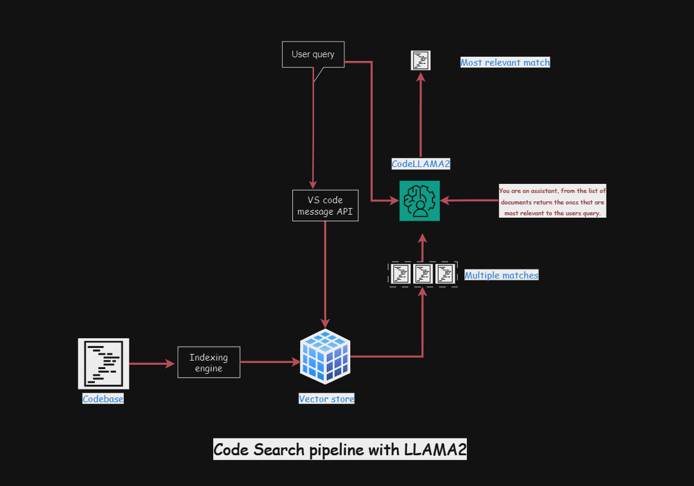

##### Read the article [here](https://medium.com/@raiharsh88/vector-search-on-codebase-using-llama2-and-chromadb-cc6c0ab8bc63)

#### This project is a beta for a VS code extension that allows you to perform vector search on codebabses.There is an idexing engine that does AST traversal of all typecript code files within the project and segments code into individual nodes and parses them back to code snippets. We then run the default embedding function (for now) provided by chromadb to convert these snippets into embedding and store them into local chromadb instance running inside the docker. Users query is searched in the vectordb, the retrieved documents are then fed to code llama model to reduce and sort the results to most relevant snippets.

#### Following is the demo and architecture.


<video  autoply>
  <source src="./assets/ai_extension_demo_1.mp4" type="video/mp4">
</video>

### Code search pipeline with LLAMA2



## Usage

### Running the pipeline

```bash
cd smart-search
```

Open extension.ts
```bash
CTRL+Shift+P -> Start debugging
```
### Running llama_server

##### Open llama_server/.env 

```bash
cd llama_server
python3 app.py
```

